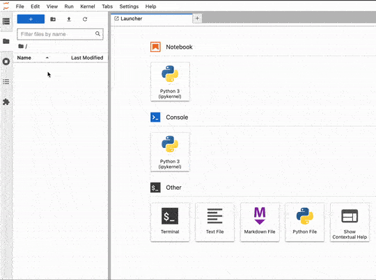

# jupyterlab-minio

[](https://github.com/aristide/jupyterlab-minio/actions/workflows/build.yml)[](https://badge.fury.io/py/jupyterlab-minio)

JupyterLab extension for browsing Minio object storage

This extension is composed of a Python package named `jupyterlab-minio`



## Installation

Works on JupyterLab 3 only

```bash
pip install jupyterlab-minio
```

You may also need to run:

```
jupyter server extension enable jupyterlab-minio
```

to make sure the serverextension is enabled and then restart (stop and start) JupyterLab.

## Usage

#### Configuration

If you have a ~/.mc/config.json file available then no futher configuration is necessary.

If you wish to configure through environment variables, you can do so using environment variables, for example:

```bash
export MINIO_ENDPOINT="https://s3.us.cloud-object-storage.appdomain.cloud"
export MINIO_ACCESS_KEY="my-access-key-id"
export MINIO_SECRET_KEY="secret"

```

You can also start without any configuration and fill in your endpoint/credentials though the form when prompted.

## Development

### Development install

Note: You will need NodeJS to build the extension package.

The `jlpm` command is JupyterLab's pinned version of
[yarn](https://yarnpkg.com/) that is installed with JupyterLab. You may use
`yarn` or `npm` in lieu of `jlpm` below.

```bash
# Clone the repo to your local environment
# Change directory to the jupyterlab-minio directory
# create and activate virualenv
virtualenv .venv
# install package manager for dev
pip install jupyter_packaging~=0.10
# Install/Reinstall the package in development mode
pip install -e .
# Link your development version of the extension with JupyterLab
jupyter labextension develop . --overwrite
# Server extension must be manually installed in develop mode
jupyter server extension enable jupyterlab-minio
# Rebuild extension Typescript source after making changes
jlpm build
```

You can watch the source directory and run JupyterLab at the same time in different terminals to watch for changes in the extension's source and automatically rebuild the extension.

```bash
# Watch the source directory in one terminal, automatically rebuilding when needed
jlpm watch
# Run JupyterLab in another terminal
jupyter lab --debug
```

With the watch command running, every saved change will immediately be built locally and available in your running JupyterLab. Refresh JupyterLab to load the change in your browser (you may need to wait several seconds for the extension to be rebuilt).

By default, the `jlpm build` command generates the source maps for this extension to make it easier to debug using the browser dev tools. To also generate source maps for the JupyterLab core extensions, you can run the following command:

```bash
jupyter lab build --minimize=False
```

### Development uninstall

```bash
# Server extension must be manually disabled in develop mode
jupyter server extension disable jupyterlab-minio
pip uninstall jupyterlab-minio
```

In development mode, you will also need to remove the symlink created by `jupyter labextension develop`
command. To find its location, you can run `jupyter labextension list` to figure out where the `labextensions`
folder is located. Then you can remove the symlink named `jupyterlab-minio` within that folder.

### Testing the extension

#### Server tests

This extension is using [Pytest](https://docs.pytest.org/) for Python code testing.

Install test dependencies (needed only once):

```sh
pip install -e ".[test]"
# Each time you install the Python package, you need to restore the front-end extension link
jupyter labextension develop . --overwrite
```

To execute them, run:

```sh
pytest -vv -r ap --cov jupyterlab-minio
```

#### Frontend tests

This extension is using [Jest](https://jestjs.io/) for JavaScript code testing.

To execute them, execute:

```sh
jlpm
jlpm test
```

#### Integration tests

This extension uses [Playwright](https://playwright.dev/docs/intro/) for the integration tests (aka user level tests).
More precisely, the JupyterLab helper [Galata](https://github.com/jupyterlab/jupyterlab/tree/master/galata) is used to handle testing the extension in JupyterLab.

More information are provided within the [ui-tests](./ui-tests/README.md) README.
